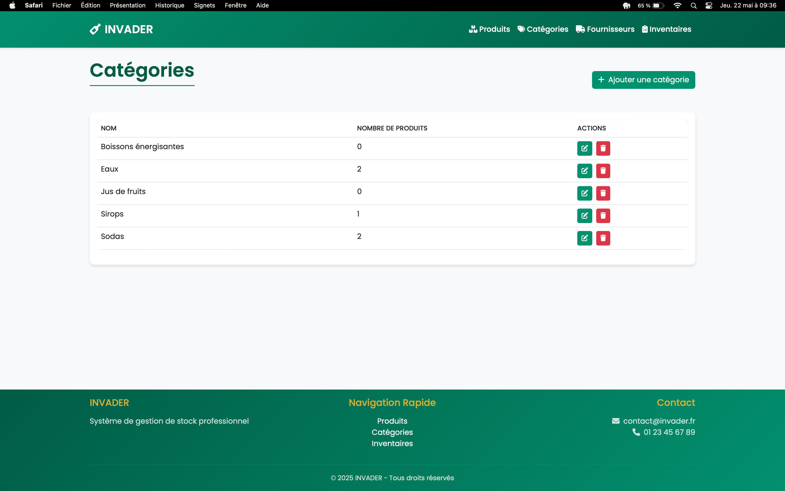
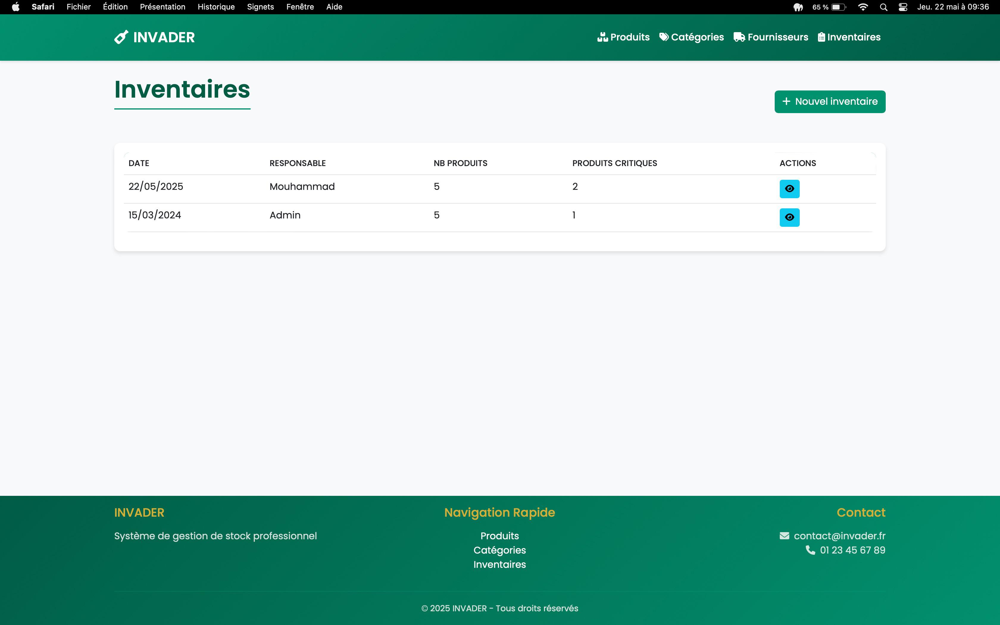
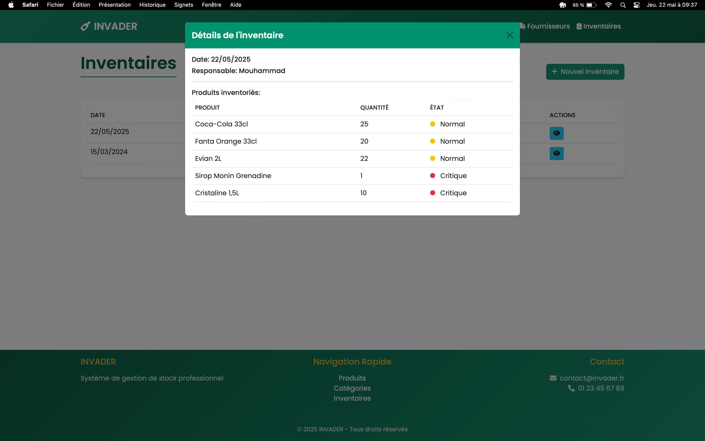
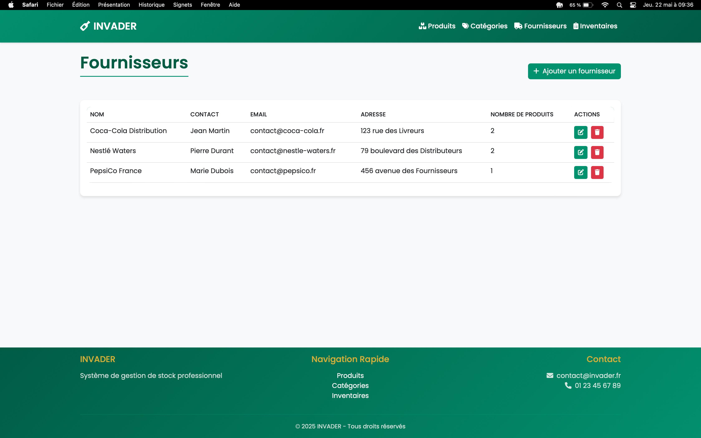
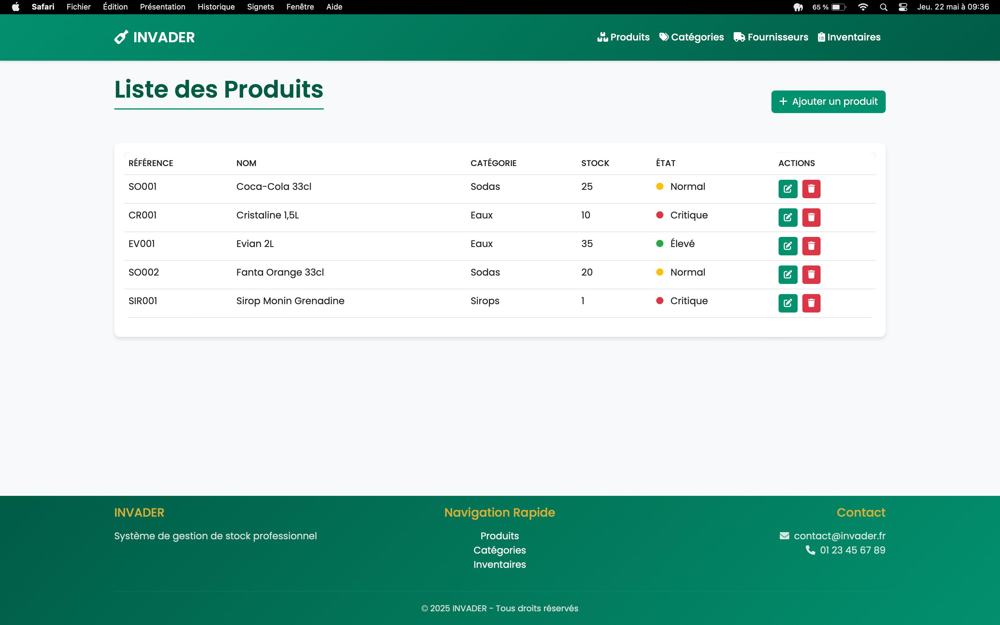
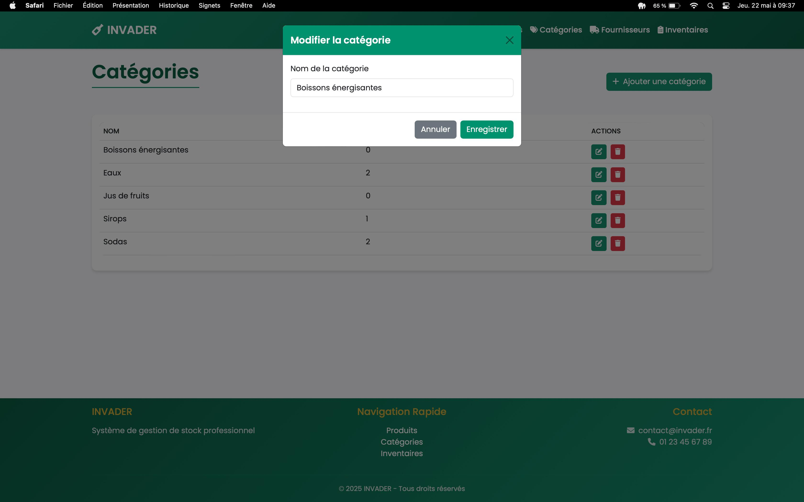
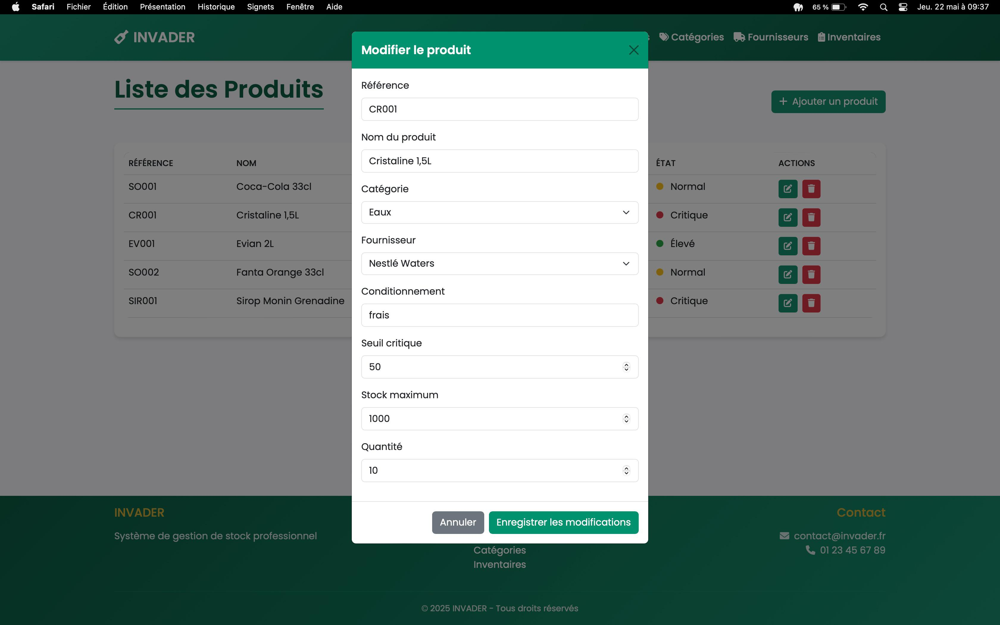

# INVADER-Application-web-de-gestion-de-stock-
# INVADER - Application web de gestion de stock

## Description
Application web de gestion de stock permettant d'ajouter, modifier et supprimer des produits, de suivre les quantités disponibles et de gérer les entrées/sorties.

## Technologies utilisées
- PHP
- MySQL
- HTML
- CSS
- JavaScript
- MAMP

## Fonctionnalités
- Authentification
- Gestion des produits
- Gestion des fournisseurs
- Suivi des stocks
- Opérations CRUD

## Captures d'écran

